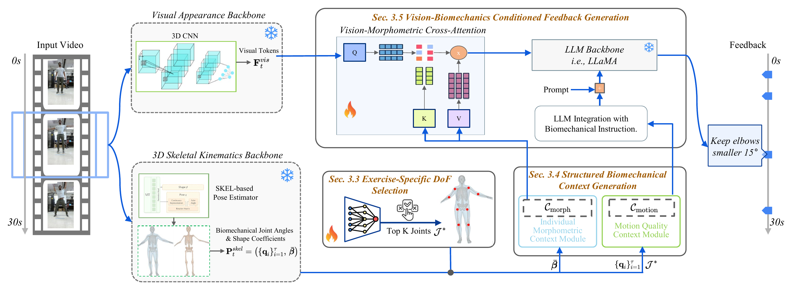

<h1 align="center">BioCoach</h1>
<h3 align="center">From 3D Pose to Prose: Biomechanics-Grounded Vision-Language Coaching</h3>
<p align="center"><b>CVPR 2026</b> &nbsp;·&nbsp; <a href="https://vilab-group.com/project/biocoach">Project page</a></p>

<p align="center"></p>

## Abstract

We present **BioCoach**, a biomechanics-grounded vision-language framework for fitness coaching from
streaming video. BioCoach fuses visual appearance and 3D skeletal kinematics through a novel
three-stage pipeline: an exercise-specific degree-of-freedom selector that focuses analysis on
salient joints; a structured biomechanical context that pairs individualized morphometrics with
cycle and constraint analysis; and a vision-biomechanics conditioned feedback module that applies
cross-attention to generate precise, actionable text. Using parameter-efficient training that
freezes the vision and language backbones, BioCoach yields transparent, personalized reasoning
rather than pattern matching. To enable learning and fair evaluation, we augment QEVD-fit-coach with
biomechanics-oriented feedback to create **QEVD-bio-fit-coach**, and we introduce a
biomechanics-aware LLM judge metric. BioCoach delivers clear gains on QEVD-bio-fit-coach across
lexical and judgment metrics while maintaining temporal triggering; on the original QEVD-fit-coach,
it improves text quality and correctness with near-parity timing, demonstrating that explicit
kinematics and constraints are key to accurate, phase-aware coaching.

## Installation

```bash
conda create -n biocoach python=3.10 -y && conda activate biocoach

# install PyTorch matching your CUDA (we used CUDA 12.1), then the rest:
pip install torch==2.5.1 torchvision==0.20.1 --index-url https://download.pytorch.org/whl/cu121
pip install -r requirements.txt
```

## Data & checkpoints

Download the
[QEVD dataset](https://www.qualcomm.com/developer/software/qevd-dataset), the
[LLaMA-2-7b-hf](https://huggingface.co/meta-llama/Llama-2-7b-hf) weights, and the Stream-VLM base checkpoint from the
[upstream FitCoach release](https://github.com/Qualcomm-AI-research/FitCoach).

EfficientNet 3D-CNN features (`efficientnet_features/`) are extracted from the QEVD
videos with the [upstream FitCoach feature extractor](https://github.com/Qualcomm-AI-research/FitCoach#data-extraction).

The 3D body inputs are produced with two codebases, we release our pre-processed
outputs so you can skip running them:

| artifact | upstream codebase | download | config field / location |
|----------|-------------------|----------|-------------------------|
| SHAPY morphometric measurements (per-subject body geometry) | [muelea/shapy](https://github.com/muelea/shapy) | [download](https://drive.google.com/drive/folders/1qRzfA0pP_18kSV72VdyG0AIVq2xgUQjR?usp=sharing) | `morphometric_dir` |
| HSMR/SKEL 3D body reconstructions | [IsshikiHugh/HSMR](https://github.com/IsshikiHugh/HSMR) | [download](https://drive.google.com/file/d/1DxpFY_fYf-yia1JatcPDmxAp8k69w7E2/view?usp=sharing) | `<data_root>/…/HSMR_outputs/` |

Pre-processed inputs and trained weights used for the released results:

| artifact | download | config field / location |
|----------|----------|-------------------------|
| Golden-standard reference | [download](https://drive.google.com/drive/folders/1ZmnD611vdbhqiK6Z0v64uLuYMPGRE3NH?usp=sharing) | `golden_standards_dir` &nbsp;(also shipped in `golden_standards/`) |
| Cross-attention — QEVD-fit-coach | [download](https://drive.google.com/file/d/1VdjGkkohQUBxxLoOtB_QX3H_06DJQ42C/view?usp=sharing) | `cross_attention_weights_path` |
| Cross-attention — QEVD-bio-fit-coach (coming soon) | [download](<CROSS_ATTENTION_BIO_URL>) | `cross_attention_weights_path` |

Set the paths in the configs (`llama2_7b_path`, `checkpoint_path`, `data_root`, `morphometric_dir`,
`golden_standards_dir`, `cross_attention_weights_path`). Expected dataset layout under `data_root`:

```text
<data_root>/
  QEVD-FIT-COACH/            # train split
  QEVD-FIT-COACH-Benchmark/  # test split
      feedbacks_long_range*.json    # ground truth (original or biomech-augmented)
      HSMR_outputs/HSMR-XXXX.npy     # per-frame 3D body reconstructions (HSMR/SKEL)
      long_range_videos/
      efficientnet_features/
```

## Usage

### QEVD-fit-coach (original)


**Evaluation**
```bash
python -m scripts.evaluate_dynamic_skeleton --config configs/biocoach_qevd_eval.yaml
```

### QEVD-bio-fit-coach (coming soon)


**Evaluation**
```bash
python -m scripts.evaluate_dynamic_skeleton --config configs/biocoach_qevd_bio_eval.yaml
```

## Citation

```bibtex
@inproceedings{ji20263d,
  title     = {From 3D Pose to Prose: Biomechanics-Grounded Vision-Language Coaching},
  author    = {Ji, Yuyang and Shen, Yixuan and Zhu, Shengjie and Kong, Yu and Liu, Feng},
  booktitle = {Proceedings of the IEEE/CVF Conference on Computer Vision and Pattern Recognition},
  pages     = {23506--23515},
  year      = {2026}
}
```